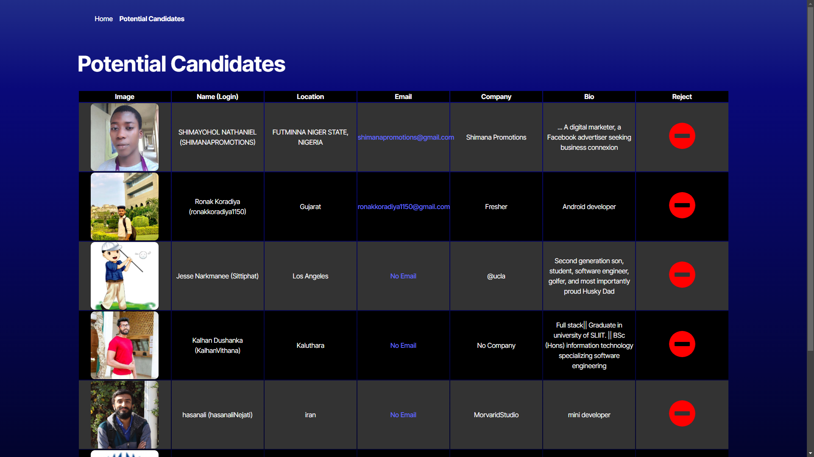

# Git For Hire
Searching for the best devs.
## Description
Git for hire is a sleek and efficient web application that helps recruiters, hiring managers, and developers discover top talent on GitHub. By leveraging the GitHub API, users can find developers based on their name, location, company, and bio. 

With Git for Hire, users can effortlessly add promising developers to a curated list of prospective candidates for future reference. The intuitive interface ensures a smooth experience for tracking and managing potential hires that is stored in location storage for the next time you open the site.
## Table of Contents
 - [Installation](#installation)
 - [Usage](#usage)
 - [Credits](#credits)
 - [License](#license)
 - [Badges](#badges)
 - [Tests](#tests)
 - [Questions](#questions)

## [Installation](#installation)
  1. Clone this repo locally;
  2. Install dependencies by running `npm i` in your terminal from the root; and
  3. `npm run dev` to start locally and open `http://localhost:3000/` or applicable port.

  ## [Usage](#usage)
  Use this to review prospective candidiates. View live version here: [Git For Hire](https://gitforhire.netlify.app/).
  
  > 1. Review each candidate and select the minus or plus sign;
  > 2. Minus will discard the candidate;
  > 3. Plus will add the candidate to a list in local storage;
  > 4. When you get to the end of the loaded list, you can click Fetch More Candidates to keep going;
  > 5. Else you can click on the potential Candidates link;
  > 6. Further refine you list by selecting the Reject button that will remove them from the list; 
  > 7. Your list will remain on your web browser you've used as long as you don't clear local storage.

  ### Application Screenshot
  
  

  ## [Credits](#credits)
  - [dotenv](https://www.npmjs.com/package/dotenv)
  - [react](https://react.dev/)
  - [react-dom](https://www.npmjs.com/package/react-dom)
  - [react-router-dom](https://www.npmjs.com/package/react-router-dom)
  - [react-icons](https://react-icons.github.io/react-icons/)
   - In Dev
      - [eslint](https://eslint.org/)
      - [vite](https://vite.dev/)
  
  ## [License](#license)
  This project is licensed under the MIT - see the [LICENSE](LICENSE) file for details.

  ## [Badges](#badges)
  
  

  ## [Tests](#tests)
   Follow [Installation](#installation) and run application locally. You'll need to include your own github token in `.env file.` Follow errors for tracing.
  
  ## [Questions](#questions)
  If you have any questions, please feel free to reach out to me at musserdn@gmail.com or visit my [GitHub Profile](https://github.com/musserdn/).